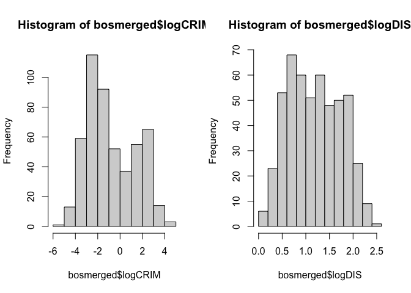
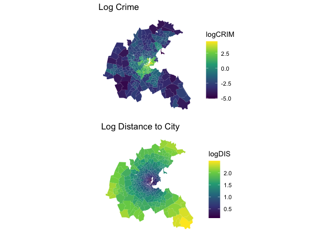
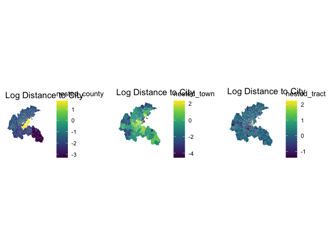
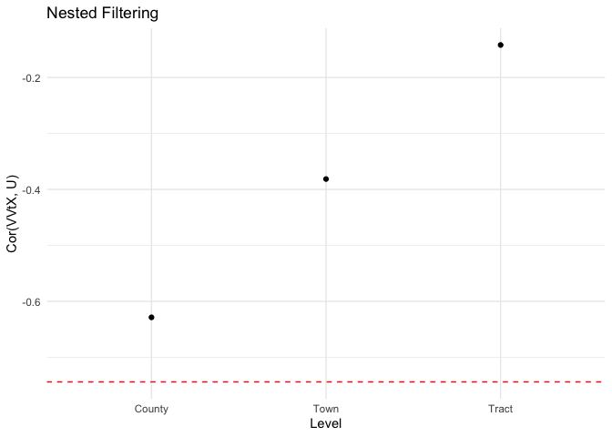
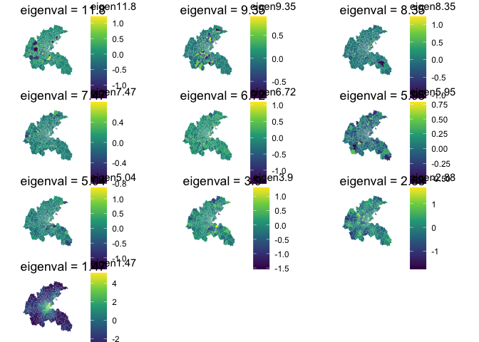
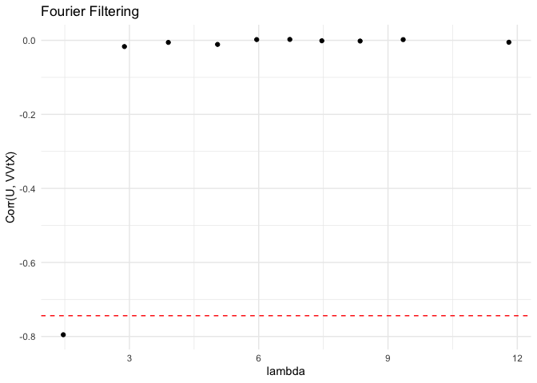
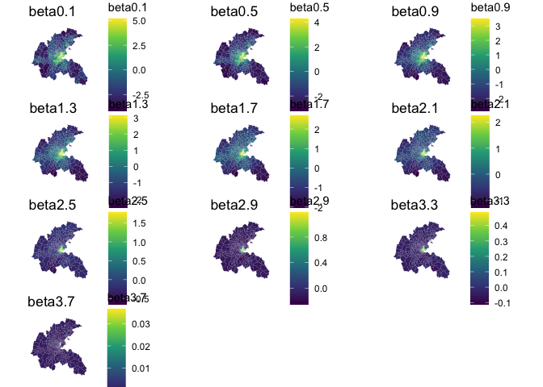
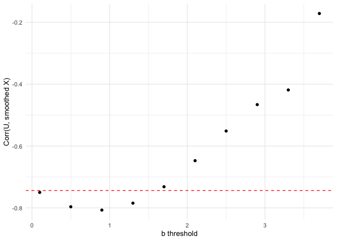

In Case Study A, the task is to examine the potential impact of crime on
adverse pregnancy outcomes in the Greater Boston area for the year 1970.
Various underlying factors that are highly correlated with proximity to
Boston city center may influence both the prevalence of criminal
activities in a given municipality and a community’s access to
healthcare, thereby affecting the risk of adverse pregnancy outcomes.

``` r
library(gasper)
library(spData)
library(sf)
library(spdep)
library(dplyr)
library(gridExtra)
library(ggplot2)
source('funcs.R')
```

## Import and Process Data

``` r
boston.tr <- sf::st_read(system.file("shapes/boston_tracts.shp",
                                     package="spData")[1])
```

    ## Reading layer `boston_tracts' from data source 
    ##   `/Library/Frameworks/R.framework/Versions/4.3-arm64/Resources/library/spData/shapes/boston_tracts.shp' 
    ##   using driver `ESRI Shapefile'
    ## Simple feature collection with 506 features and 36 fields
    ## Geometry type: POLYGON
    ## Dimension:     XY
    ## Bounding box:  xmin: -71.52311 ymin: 42.00305 xmax: -70.63823 ymax: 42.67307
    ## Geodetic CRS:  NAD27

``` r
boston_counties <- st_read("townssurvey_shp/TOWNSSURVEY_POLY.shp")
```

    ## Reading layer `TOWNSSURVEY_POLY' from data source 
    ##   `/Users/sophie/Documents/SpatialConf/townssurvey_shp/TOWNSSURVEY_POLY.shp' 
    ##   using driver `ESRI Shapefile'
    ## Simple feature collection with 1239 features and 22 fields
    ## Geometry type: POLYGON
    ## Dimension:     XY
    ## Bounding box:  xmin: 33863.73 ymin: 777606.4 xmax: 330837 ymax: 959743
    ## Projected CRS: NAD83 / Massachusetts Mainland

``` r
# sourced from https://www.mass.gov/info-details/massgis-data-municipalities#downloads-

boston.tr$TOWN[1:132] = 'Boston'
boston.tr$TOWN[186:189] = 'Saugus'
boston.tr$TOWN = toupper(boston.tr$TOWN)
#boston.tr$TOWN %in% boston_counties$TOWN 
bosmerged = merge(boston.tr, cbind.data.frame('TOWN' = boston_counties$TOWN, 
                                              'FIPS' = boston_counties$FIPS_COUNT),
                  by = 'TOWN')
bosmerged = distinct(bosmerged)
nrow(bosmerged)
```

    ## [1] 506

``` r
length(unique(bosmerged$TRACT))
```

    ## [1] 506

``` r
length(unique(bosmerged$TOWN))
```

    ## [1] 78

``` r
length(unique(bosmerged$FIPS))
```

    ## [1] 5

## Crime and Distance: Exploratory Analysis

Below we plot 1) weighted distance to five Boston employment centers,
serving as a proxy for distance to Boston’s city center (confounder),
and 2) the per-capita crime rate (exposure) across municipalities. It is
visually evident that the spatial confounder, distance to Boston’s city
center, varies more smoothly in space in comparison with the exposure
variable, the per-capita crime rate.

``` r
bosmerged$logCRIM = log(bosmerged$CRIM)
bosmerged$logDIS = log(bosmerged$DIS)
par(mfrow = c(1,2))
hist(bosmerged$logCRIM)
hist(bosmerged$logDIS)
```



``` r
g1 = ggplot(bosmerged) +
  geom_sf(aes(fill = logCRIM), color = NA) +
  scale_fill_viridis_c() + 
  labs(title = 'Log Crime') + 
  theme_minimal() +
  theme(axis.text.x = element_blank(),
        axis.text.y = element_blank(),
        axis.ticks = element_blank(),
        line = element_blank(),
        axis.title = element_blank(),
        panel.grid.major = element_line(colour = "transparent"))

g2 = ggplot(bosmerged) +
  geom_sf(aes(fill = logDIS), color = NA) +
  scale_fill_viridis_c() + 
  labs(title = 'Log Distance to City') + 
  theme_minimal() +
  theme(axis.text.x = element_blank(),
        axis.text.y = element_blank(),
        axis.ticks = element_blank(),
        line = element_blank(),
        axis.title = element_blank(),
        panel.grid.major = element_line(colour = "transparent"))

grid.arrange(grobs = list(g1, g2))
```



## Nested Filtering

Is Cor(*V**V*<sup>*t*</sup>*X*,*U*) is smaller with finer level in the
nested decomposition? Yes.

``` r
groups = cbind(bosmerged$FIPS, bosmerged$TOWN)
nest = nested_decomp_mats(groups)
bosmerged$nested_county = nest$decomp_mats[[1]] %*% bosmerged$logCRIM
bosmerged$nested_town = nest$decomp_mats[[2]] %*% bosmerged$logCRIM
bosmerged$nested_tract = nest$decomp_mats[[3]] %*% bosmerged$logCRIM

g3 = ggplot(bosmerged) +
  geom_sf(aes(fill = nested_county), color = NA) +
  scale_fill_viridis_c() + 
  labs(title = 'Log Distance to City') + 
  theme_minimal() +
  theme(axis.text.x = element_blank(),
        axis.text.y = element_blank(),
        axis.ticks = element_blank(),
        line = element_blank(),
        axis.title = element_blank(),
        panel.grid.major = element_line(colour = "transparent"))
g4 = ggplot(bosmerged) +
  geom_sf(aes(fill = nested_town), color = NA) +
  scale_fill_viridis_c() + 
  labs(title = 'Log Distance to City') + 
  theme_minimal() +
  theme(axis.text.x = element_blank(),
        axis.text.y = element_blank(),
        axis.ticks = element_blank(),
        line = element_blank(),
        axis.title = element_blank(),
        panel.grid.major = element_line(colour = "transparent"))
g5 = ggplot(bosmerged) +
  geom_sf(aes(fill = nested_tract), color = NA) +
  scale_fill_viridis_c() + 
  labs(title = 'Log Distance to City') + 
  theme_minimal() +
  theme(axis.text.x = element_blank(),
        axis.text.y = element_blank(),
        axis.ticks = element_blank(),
        line = element_blank(),
        axis.title = element_blank(),
        panel.grid.major = element_line(colour = "transparent"))

grid.arrange(grobs = list(g3,g4,g5), ncol = 3)
```



``` r
corcounty = cor(bosmerged$nested_county, bosmerged$logDIS)
cortown = cor(bosmerged$nested_town, bosmerged$logDIS)
cortract= cor(bosmerged$nested_tract, bosmerged$logDIS)

datnested = data.frame(Level = c('County', 'Town', 'Tract'),
                   Correlation = c(corcounty, cortown, cortract))

# Plot correlations
ggplot(datnested, aes(x = Level, y = Correlation)) +
  geom_point(shape = 19) +
  geom_hline(yintercept = cor(bosmerged$logCRIM, bosmerged$logDIS), 
             linetype = "dashed", color = "red") +
  labs(title = "Nested Filtering",
       y = "Cor(VVtX, U)") +
  theme_minimal() +
  scale_x_discrete(labels = c('County', 'Town', 'Tract'))
```



## Fourier Filtering

Is Cor(*V**V*<sup>*t*</sup>*X*,*U*) is smaller with higher eigenvalue in
the Fourier decomposition? Yes.

``` r
nbsbos = poly2nb(bosmerged) 
bosadj = nb2mat(neighbours = nbsbos, style = 'B', zero.policy = T)
edges = sum(bosadj)
L = diag(rowSums(bosadj)) - bosadj
E = eigen(L)
evalues = E$values
evectors = E$vectors

gs = list()
maxevals = rep(NA, 10)
cors = rep(NA, 10)
for (i in 1:10){
  ixs = ((i-1)*50+6):(50*i+5)
  V = evectors[,ixs]
  maxeval = evalues[(i-1)*50+6]
  maxevals[i] = maxeval
  name = paste('eigen', round(maxeval,2), sep = '')
  eigenpart = V%*%t(V) %*% bosmerged$logCRIM
  bosmerged[[name]] = eigenpart
  gs[[i]] = ggplot(bosmerged) +
    geom_sf(aes_string(fill = name), color = NA) +
    scale_fill_viridis_c() + 
    labs(title = paste('eigenval =', round(maxeval,2))) + 
    theme_minimal() +
    theme(axis.text.x = element_blank(),
          axis.text.y = element_blank(),
          axis.ticks = element_blank(),
          line = element_blank(),
          axis.title = element_blank(),
          panel.grid.major = element_line(colour = "transparent"))
  cors[i] = cor(bosmerged$logDIS, eigenpart)
}
```

    ## Warning: `aes_string()` was deprecated in ggplot2 3.0.0.
    ## ℹ Please use tidy evaluation idioms with `aes()`.
    ## ℹ See also `vignette("ggplot2-in-packages")` for more information.
    ## This warning is displayed once every 8 hours.
    ## Call `lifecycle::last_lifecycle_warnings()` to see where this warning was
    ## generated.

``` r
grid.arrange(grobs = gs)
```



``` r
# Plot correlations
ggplot(data.frame(maxevals = maxevals, cors = cors), aes(x = maxevals, y = cors)) +
  geom_point(shape = 19) +
  geom_hline(yintercept = cor(bosmerged$logCRIM, bosmerged$logDIS), 
             linetype = "dashed", color = "red") +
  labs(x = "lambda", y = "Corr(U, VVtX)", title = "Fourier Filtering") +
  theme_minimal()
```



## Wavelet Filtering

``` r
gridbos = list('sA' = bosadj, 'xy' = cbind(bosmerged$LON, bosmerged$LAT))
bfilters = seq(0.1,3.7,by = 0.4)
cors = rep(NA, length(bfilters))
gs = list()
for (i in 1:length(bfilters)){
  b = bfilters[i]
  tf = tight_frame(evalues, evectors, 2)
  coef = gasper::analysis(bosmerged$logCRIM, tf)
  beta = betathresh(coef, b, 2)
  logcrim_smooth = synthesis(beta, tf)
  name = paste('beta', b, sep = '')
  bosmerged[[name]] = logcrim_smooth
  #plot_signal(gridbos, logcrim_smooth, size = 2)
  gs[[i]] = ggplot(bosmerged) +
    geom_sf(aes_string(fill = name), color = NA) +
    scale_fill_viridis_c() + 
    labs(title = name) + 
    theme_minimal() +
    theme(axis.text.x = element_blank(),
          axis.text.y = element_blank(),
          axis.ticks = element_blank(),
          line = element_blank(),
          axis.title = element_blank(),
          panel.grid.major = element_line(colour = "transparent"))
  cors[i] = cor(bosmerged$logDIS, logcrim_smooth)
}
grid.arrange(grobs = gs)
```



``` r
ggplot(data.frame(bfilters = bfilters, cors = cors), aes(x = bfilters, y = cors)) +
  geom_point(shape = 19) +
  geom_hline(yintercept = cor(bosmerged$logCRIM, bosmerged$logDIS), linetype = "dashed", 
             color = "red") +
  labs(x = "b threshold", y = "Corr(U, smoothed X)") +
  theme_minimal()
```


